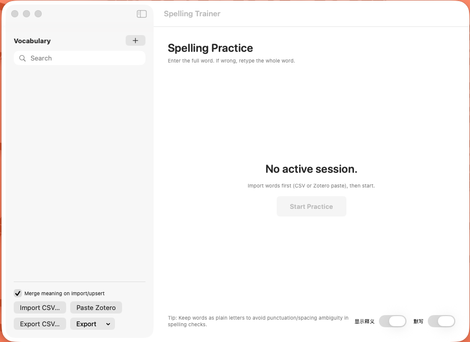

# Spelling Trainer 



一个面向**学术阅读工作流**的轻量级 macOS 词汇训练工具。它支持你快速导入生词（尤其来自 Zotero PDF 高亮），并通过类 QWERTY-Learner 的输入界面进行拼写练习。

该项目有意采用**单文件 SwiftUI MVP**实现，便于理解、修改与扩展。

## 核心功能

- **从 Zotero 高亮快速导词**：粘贴复制的 PDF 高亮内容，自动提取单词与释义。
- **基于输入的拼写练习**：使用类 QWERTY-Learner 的打字界面进行词汇训练。
- **两种练习模式**：提供严格拼写模式和跟打模式，适配不同学习阶段。
- **基于 session 的训练**：每次练习会自动混合新词与复习词。
- **轻量本地词库**：所有数据以简单 JSON 文件形式保存在本地。
- **可搜索词表**：快速定位单词，查看释义与练习记录。
- **macOS 原生 SwiftUI 界面**：轻快简洁，完全贴合 macOS UI 风格。

## 推荐工作流

结合 Zotero Translation 的典型使用流程：

```
1. 在 Zotero PDF 中高亮单词
2. 复制高亮内容
3. 点击 "Paste Zotero"
4. 点击 "Start Practice"
```

## 安装

你可以在 GitHub **Releases** 页面下载预编译应用：

https://github.com/JiangXY98/SpellingTrainer/releases

步骤：

1. 打开仓库的 **Releases** 页面。
2. 下载最新版本中类似以下名称的文件：

```
SpellingTrainer.app.zip
```

3. 解压后得到：

```
SpellingTrainer.app
```

4. 将应用移动到 **Applications** 文件夹。

5. 由于该应用未使用 Apple Developer 证书签名，macOS 首次启动时可能会拦截。请在终端执行：

```
sudo xattr -r -d com.apple.quarantine /Applications/SpellingTrainer.app
```

完成后即可正常启动应用。

# 构建应用

如果你从 GitHub 克隆本项目，典型仓库结构如下：

```
SpellingTrainer
├── SpellingTrainer
    └── SpellingTrainerApp.swift
    │
    ├── Assets.xcassets
    ├── README.md
    ├── LICENSE
    └── .gitignore
```

环境要求：

```
macOS
Xcode
SwiftUI
```

步骤：

```
1. 在 Xcode 中打开项目
2. 选择 "My Mac" 目标
3. Product → Build
```

编译后的应用会出现在：

```
Build/Products/Release/SpellingTrainer.app
```

你可以将其移动到：

```
/Applications
```

---

# 作者

**Xiaoyu Jiang**

博士研究人员 - 消费者行为与神经决策科学

该工具最初用于支持高强度学术阅读中的词汇积累（尤其是基于 Zotero 的文献工作流）。

## 当前设计理念

本项目有意优先追求：

```
清晰
易改
低复杂度
```

项目没有采用 CoreData 或复杂架构，而是将核心实现集中在**一个 Swift 文件**中，以支持快速迭代。

---

# 致谢

本项目受 [QWERTY-Learner](https://github.com/RealKai42/qwerty-learner) 的输入交互启发，并针对个人词汇学习与研究工作流做了适配。

---

如果你觉得这个工具有帮助，欢迎 fork 仓库并按你的工作流进行改造。

---

# 许可证

本项目当前采用 **MIT License** 发布。

MIT 许可证允许任何人：

• 使用软件
• 修改源码
• 重新分发项目
• 将其集成到其他项目中

前提是保留对原作者的署名。

完整许可证文本见仓库中的 `LICENSE` 文件。
