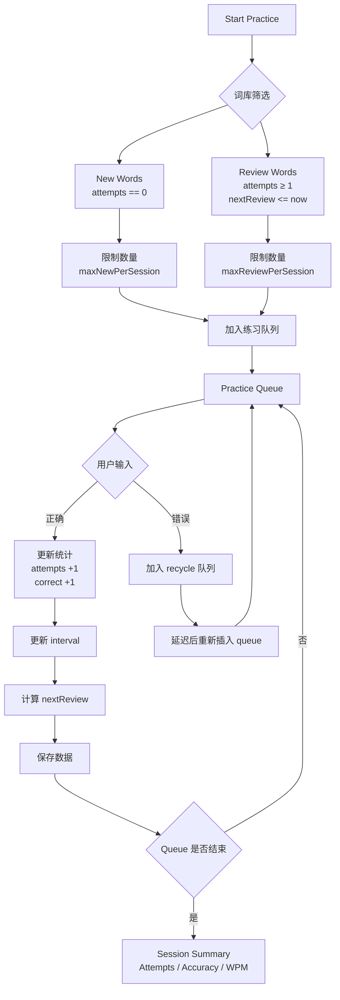

# 单词练习的抽取逻辑（Practice Selection Logic）

Spaced Repetition System, SRS 算法

---

# SRS 调度结构图



---

本文档总结当前 **Spelling Trainer** 在每次开始练习（Start Practice）时，如何从词库中抽取需要练习的单词。

---

# 1 词条状态

每个单词在数据文件中都会记录练习历史，包括：

- attempts（总练习次数）
- correct / wrong
- accuracy
- nextReview
- interval
- difficulty

根据这些信息，系统将单词划分为两类：

## 1.1 New words（新单词）

定义：

```
attempts == 0
```

即从未被练习过的单词。

## 1.2 Review words（复习单词）

定义：

```
attempts ≥ 1
```

且满足：

```
nextReview <= now
```

即已经到达下一次复习时间的单词。

---

# 2 Session 参数（Settings）

每次练习会话会受到两个设置参数限制：

```
Max new per session
Max reviews per session
```

默认值：

```
Max new per session = 10
Max reviews per session = 30
```

这些参数可以在 **Settings → Session Limits** 中调整。

---

# 3 单次练习的抽取流程

当用户点击 **Start Practice** 时，系统按以下顺序构建本次练习队列：

## Step 1 获取所有候选词

从词库中筛选：

```
newWords
reviewWords
```

其中：

```
newWords = attempts == 0
reviewWords = attempts >= 1 AND nextReview <= now
```

---

## Step 2 抽取 New Words

从 `newWords` 中抽取：

```
min(newWords.count, maxNewPerSession)
```

这些单词优先加入练习队列。

---

## Step 3 抽取 Review Words

从 `reviewWords` 中抽取：

```
min(reviewWords.count, maxReviewPerSession)
```

加入队列。

---

## Step 4 构建练习队列

最终队列结构为：

```
queue = newWords + reviewWords
```

顺序：

```
先 new words
再 review words
```

因此：

```
sessionSize ≤ maxNewPerSession + maxReviewPerSession
```

但如果词库不足，则实际数量会更少。

---

# 4 练习过程中的行为

## 4.1 Strict 模式

- 输入错误
- 当前单词立即进入 recycle 队列
- 在本 session 结束前重新出现


## 4.2 Copy 模式

- 输入框中显示目标单词的 ghost text
- 用于打字练习

---

# 5 单词完成后的更新

每个单词完成练习后会更新：

```
attempts += 1
correct / wrong
accuracy
```

并更新复习计划：

```
nextReview
interval
```

该逻辑类似于 **简化版 spaced repetition**。

---

# 6 Stop Session

点击 **Stop** 时：

```
queue = []
recycle = []
current = nil
```

但本次 session 的统计信息仍然保留：

```
attempts
accuracy
WPM
streak
```

并在主界面显示 **Last Session Summary**。

---

# 7 总结

每次练习的核心逻辑可以简化为：

```
queue = newWords(limit) + reviewWords(limit)

practice(queue)

update statistics
schedule next review
```

该机制保证：

- 新单词逐步加入
- 到期单词优先复习
- session 大小可控
- 错误单词在当前 session 内强化练习


